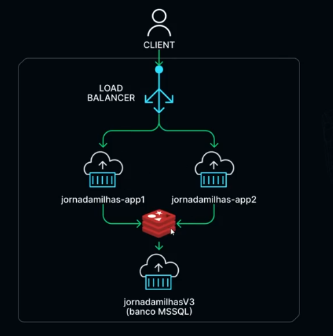

# JourneyMiles.API

A simple ASP.NET Core API to study and demonstrate **Clean Architecture** and **Domain-Driven Design (DDD)** principles, now containerized and ready for cloud deployment.

The project has evolved to incorporate a microservices-oriented architecture using Docker, with multiple instances of the API, a Redis cache, and a SQL Server database, orchestrated for scalability and resilience.

## Tech Stack

- **.NET 8**
- **ASP.NET Core**
- **Entity Framework Core**
- **Dapper**
- **SQL Server**
- [cite_start]**Redis** [cite: 1]
- **Docker**
- **FluentMigrator**
- **FluentValidation**
- **AutoMapper**
- **Swashbuckle (Swagger)**

## Architecture

The solution is structured following Clean Architecture principles, separating concerns into `Domain`, `Application`, `Infrastructure`, and `API` layers.

The infrastructure is designed to run in containers, as defined in the `docker-compose.yml` file. The diagram below illustrates the high-level cloud architecture deployed on Azure:



-   [cite_start]**Azure Container Registry (ACR)**: Stores the container images for the API. [cite: 1]
-   **Azure Container Instances (ACI)**: Hosts the running containers:
    -   [cite_start]Two instances of the JourneyMiles API (`journeymiles.api1`, `journeymiles.api2`) for high availability. [cite: 1]
    -   [cite_start]A Redis instance for caching. [cite: 1]
    -   [cite_start]A Microsoft SQL Server instance for data persistence. [cite: 1]
-   **Azure Load Balancer**: Distributes incoming client traffic across the two API instances.
-   **Virtual Network (VNET)**: Ensures secure communication between the container instances.

## How to Run Locally with Docker

1.  **Prerequisites**: You will need [Docker Desktop](https://www.docker.com/products/docker-desktop/) installed and running.

2.  **Clone**: Clone the repository to your local machine.

3.  **Build and Run**: Open a terminal in the project's root folder and execute the following command:
    ```sh
    docker-compose up --build
    ```
    This command will build the API images and start all the services (two API instances, SQL Server, and Redis). The database migrations will run automatically to set up the schema.

4.  **Access the APIs**:
    -   API instance 1 will be available at `http://localhost:57398`.
    -   API instance 2 will be available at `http://localhost:57396`.

You can access the Swagger UI for each instance by navigating to `/swagger` on their respective URLs.